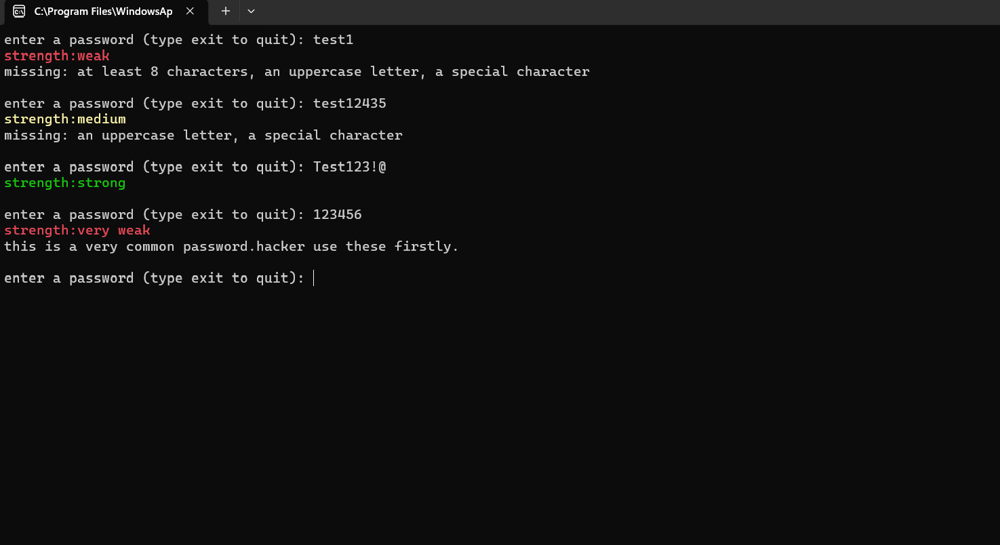

<div align="center">

# 🔐 Password Strength Checker v1

A simple Python tool that checks how strong your password is and tells you what’s missing.  
Built for my first cybersecurity project to practice Python + basic security concepts.


---

</div>

<h2 align="center">🚀 Features</h2>

- ✅ Checks password length, uppercase, lowercase, numbers, and symbols
- ⚠️ Detects common weak passwords like 123456, password
- 🎨 Color-coded output: Green = Strong, Yellow = Medium, Red = Weak
- 💡 Shows exactly what’s missing in weak passwords
- 🖥️ Works in any terminal - Windows, Mac, Linux


## <h2 align="center">🛠️ How to Run</h2>

1. Make sure you have Python 3 installed
2. Download password_checker.py from the v1 folder
3. Open terminal in the folder and run:
```bash

```
<h2 align="center">📸 Example Output</h2>
<div align="center">
   
</div>
<div align="center">


<h2 align="center">🚀 Future Improvements</h2>

<p><i>This is v1.0 of the project. The following features are planned for future releases:</i></p>

</div>

### Planned Enhancements

<table>
<tr>
<td width="50%">

#### 1. 🖥️ Graphical User Interface  
Develop a Tkinter-based GUI to make the tool more user-friendly and eliminate the need for terminal usage.

#### 2. ⏱️ Password Crack Time Estimation  
Use algorithms like zxcvbn to estimate how long it would take to crack the password.

#### 3. 📊 Password Strength Score  
Show a score out of 100 instead of just Strong/Medium/Weak for more detailed feedback.

#### 4. 🔑 Password Generator  
Add a feature to generate cryptographically secure passwords based on user-defined criteria.

</td>
<td width="50%">

#### 5. 📄 Export & Logging  
Allow users to export results and history to a .txt or .csv file for record-keeping.

#### 6. 🌐 Multi-language Support  
Add support for Sinhala and other languages for error messages and feedback.

#### 7. 💡 Password Suggestions  
If the password is weak, suggest a stronger version automatically.

#### 8. ✅ Already Implemented in v2.0  
- *Breach Database Check* using HaveIBeenPwned API  
Check the v2.0 release for this feature.

</td>
</tr>
</table>

<div align="center">

```python
